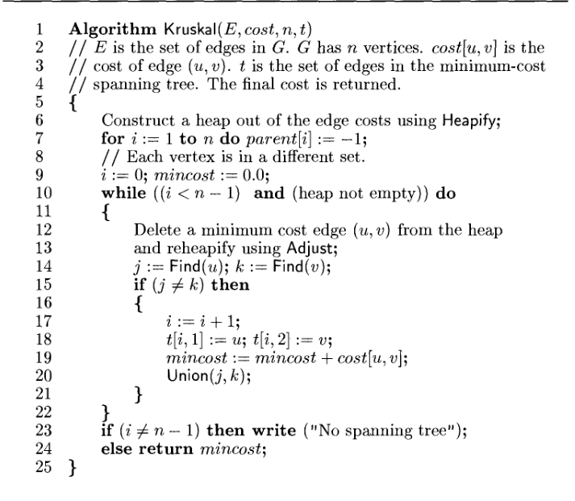

# Kruskal's Minimum Cost Spanning Tree

**DAA Lab — Experiment 6: Kruskal's Minimum Cost Spanning Tree.**

`main.py` builds a minimum spanning tree (MST) with Kruskal's algorithm: sort the
edges by weight and add them cheapest-first, skipping any edge that would form a
cycle. Cycle detection uses a **union-find** (disjoint-set) structure.

## Algorithm

1. Push all edges into a min-heap keyed by weight (`heapq`).
2. Initialise `parent[i] = -1` — every vertex is its own set.
3. Pop the cheapest edge `(c, u, v)`. `Find(u)` and `Find(v)` return set roots; if
   the roots differ, the edge joins two components, so add it to the tree and
   `Union` the sets. If the roots are equal the edge would make a cycle — skip it.
4. Stop once `n-1` edges have been added; if fewer are possible the graph is
   disconnected and "No spanning tree" is reported.

## Run

```bash
python3 main.py
```

Enter the vertex count, edge count, then each edge as `u v w`.

## Complexity

`O(E log E)` — dominated by ordering the edges. Union-find operations are
near-constant time. Kruskal's suits sparse graphs where edges are easy to sort.


