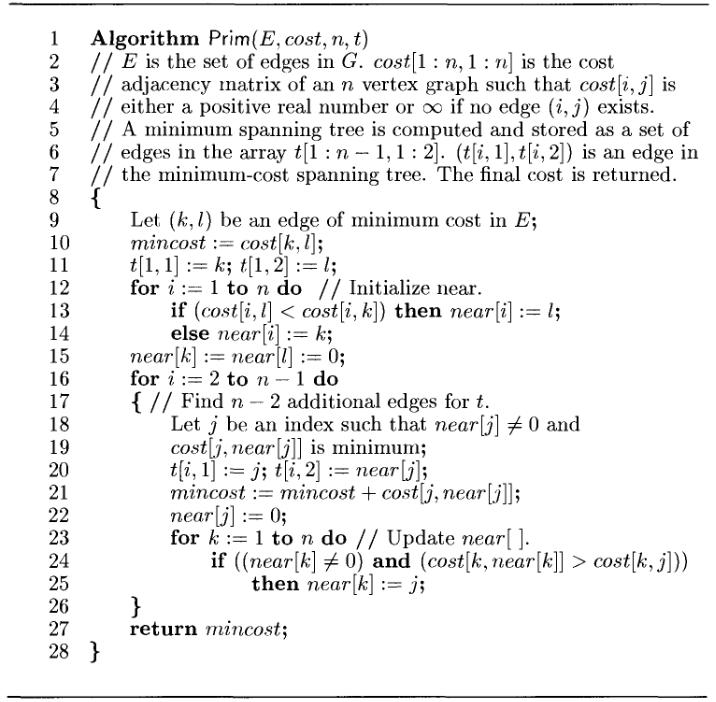

# Prim's Minimum Cost Spanning Tree

**DAA Lab — Experiment 5: Prim's Minimum Cost Spanning Tree.**

`main.py` builds a minimum spanning tree (MST) of a weighted undirected graph
using Prim's algorithm from the Horowitz–Sahni cost-matrix formulation, storing
the `n-1` tree edges in `t` and returning their total cost.

## Algorithm

Prim's grows a single tree from a starting edge:

1. Pick the globally cheapest edge `(k, l)` as the first tree edge.
2. Keep a `near[]` array: for every vertex not yet in the tree, `near[i]` is the
   in-tree vertex it is cheapest to attach to.
3. Repeatedly add the non-tree vertex `j` with the smallest `cost[j][near[j]]`,
   record edge `(j, near[j])`, then update `near[]` for the remaining vertices.

The graph is given as a `cost` adjacency matrix where absent edges are `∞`.

## Run

```bash
python3 main.py
```

Enter the vertex count, edge count, then each edge as `u v w`.

## Complexity

`O(n²)` with the `near[]` array and an adjacency matrix — well suited to dense
graphs. (A binary-heap adjacency-list version runs in `O(E log V)`.)


