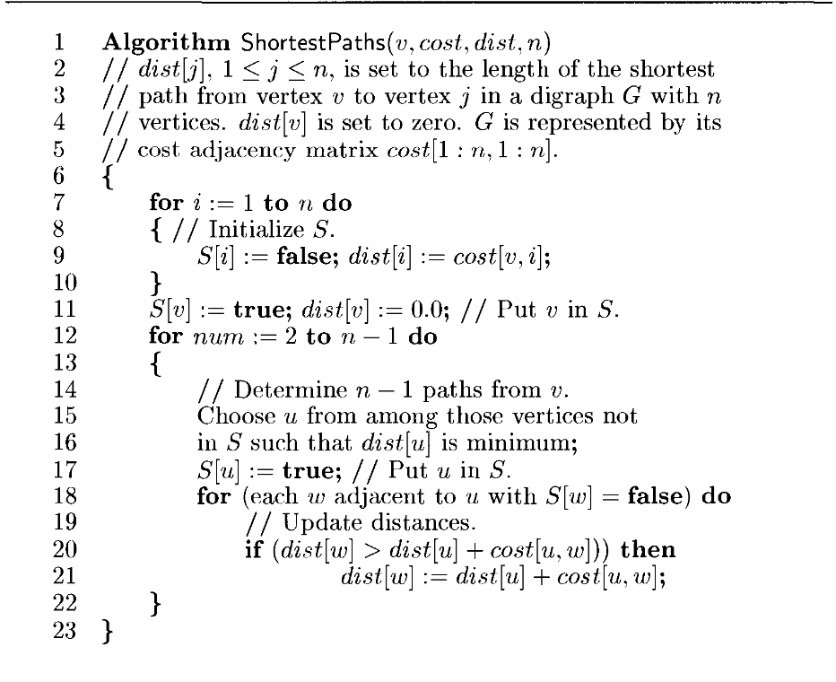

# Dijkstra's Single Source Shortest Path

**DAA Lab — Experiment 7: Dijkstra's Single Source Shortest Path.**

`main.py` computes the shortest distance from one source vertex to every other
vertex of a weighted directed graph using Dijkstra's greedy algorithm, printing
the `S` (settled) set and the `DIST` array after each step so the algorithm can
be traced by hand.

## Algorithm

`ShortestPaths(v, cost, dist, n)`:

1. Initialise `dist[i] = cost[v][i]` (direct edge from the source, else `∞`) and
   mark the source settled.
2. Repeat `n-1` times: pick the unsettled vertex `u` with the smallest `dist[u]`,
   settle it, then **relax** every edge out of `u` —
   `dist[w] = min(dist[w], dist[u] + cost[u][w])`.
3. A parent array `P[]` records the predecessor of each vertex so the path (not
   just the distance) can be recovered.

The graph is a `cost` adjacency matrix with `∞` for absent edges. Dijkstra's
requires **non-negative** edge weights.

## Run

```bash
python3 main.py
```

Enter the source vertex; the built-in 8-vertex graph is then solved and traced.

## Complexity

`O(n²)` with the linear-scan "select minimum" and an adjacency matrix. A
min-heap adjacency-list version runs in `O((V + E) log V)`.


